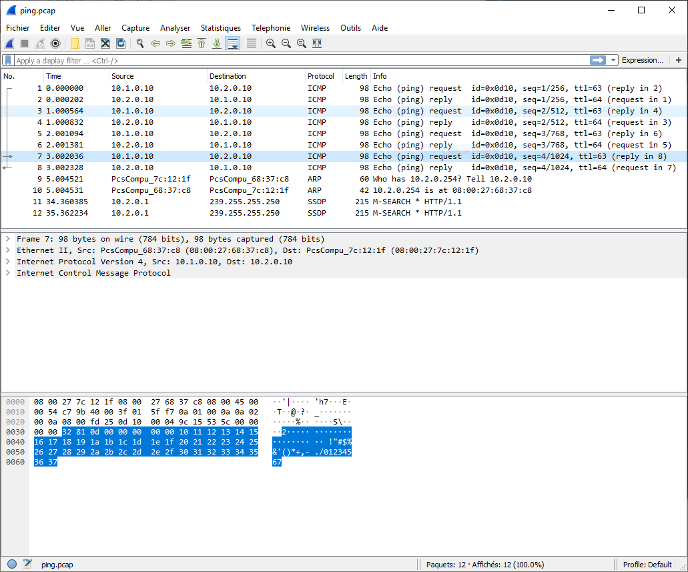

# B1A-tp-4-reseau
## Mise en place du lab
### Création des VMS
#### Checklist

Ping sur la VM du client:
```
[root@vm_client_tp4 etc]# ping router
PING router (10.1.0.254) 56(84) bytes of data.
64 bytes from router (10.1.0.254): icmp_seq=1 ttl=64 time=0.674 ms
64 bytes from router (10.1.0.254): icmp_seq=2 ttl=64 time=0.755 ms
```

Ping sur la VM server:
```
[root@vm_server_tp4 etc]# ping router
PING router (10.2.0.254) 56(84) bytes of data.
64 bytes from router (10.2.0.254): icmp_seq=1 ttl=64 time=1.18 ms
64 bytes from router (10.2.0.254): icmp_seq=2 ttl=64 time=0.805 ms
```

Ping sur la VM rooter:
Jusqu'au client
```
[root@vm_rooter_tp4 etc]# ping client
PING client (10.1.0.10) 56(84) bytes of data.
64 bytes from client (10.1.0.10): icmp_seq=1 ttl=64 time=0.750 ms
64 bytes from client (10.1.0.10): icmp_seq=2 ttl=64 time=0.816 ms
```

Jusqu'au server
```
[root@vm_rooter_tp4 etc]# ping server
PING server (10.2.0.10) 56(84) bytes of data.
64 bytes from server (10.2.0.10): icmp_seq=1 ttl=64 time=0.654 ms
64 bytes from server (10.2.0.10): icmp_seq=2 ttl=64 time=0.770 ms
```

### Mise en place du routage statique

Je modifie les fichiers route-enp0s3 sur la vm client et serveur pour rajouter les routes suivantes.
Sur le client:
```
10.2.0.254/24 via 10.1.0.254 dev enp0s3
10.2.0.10/24 via 10.1.0.254 dev epn0s3
10.2.0.0/24 via 10.1.0.254 dev enp0s3
```

Sur le server:
```
10.1.0.254/24 via 10.2.0.254 dev enp0s3
10.1.0.10/24 via 10.2.0.254 dev enp0s3
10.1.0.0/24 via 10.2.0.254 dev enp0s3
```

Et donc en résultat avec des traceroute
Sur le client:
```
[root@vm_client_tp4 network-scripts]# traceroute server
traceroute to server (10.2.0.10), 30 hops max, 60 byte packets
 1  router (10.1.0.254)  0.618 ms  0.599 ms  0.594 ms
 2  server (10.2.0.10)  0.969 ms  1.308 ms  1.073 ms
```

Sur le server:
```
[root@vm_server_tp4 network-scripts]# traceroute client
traceroute to client (10.1.0.10), 30 hops max, 60 byte packets
 1  router (10.2.0.254)  0.556 ms  0.269 ms  0.545 ms
 2  client (10.1.0.10)  0.717 ms !X  0.788 ms !X  1.087 ms !X
```

## Spéléologie réseau

### ARP

#### Manip1

Table arp du client:
```
[root@vm_client_tp4 network-scripts]# ip neigh show
10.1.0.1 dev enp0s3 lladdr 0a:00:27:00:00:13 REACHABLE
```
Il s'agit de l'adresse internet du réseau avec son adresse mac

Table arp du server:
```
[root@vm_server_tp4 network-scripts]# ip neigh show
10.2.0.1 dev enp0s3 lladdr 0a:00:27:00:00:0f REACHABLE
```
Il s'agit de l'adresse internet du réseau avec son adresse mac

Table arp du client après ping du server:
```
[root@vm_client_tp4 network-scripts]# ip neigh show
10.1.0.254 dev enp0s3 lladdr 08:00:27:e2:cc:13 REACHABLE
10.1.0.1 dev enp0s3 lladdr 0a:00:27:00:00:13 REACHABLE
```
L'adresse ip ainsi que l'adresse mac du root sur le serveur du server ont été ajouté.

Table arp du server après ping du client:
```
[root@vm_server_tp4 network-scripts]# ip neigh show
10.2.0.254 dev enp0s3 lladdr 08:00:27:68:37:c8 DELAY
10.2.0.1 dev enp0s3 lladdr 0a:00:27:00:00:0f DELAY
```
L'adresse ip ainsi que l'adresse mac du root sur le serveur du client ont été ajouté.

#### Manip 2

Table ARP du router:
```
[root@vm_rooter_tp4 etc]# ip neigh show
10.1.0.1 dev enp0s3 lladdr 0a:00:27:00:00:13 DELAY
```
Il s'agit de l'adresse ip et mac du premier réseau connecter au rooter.

Table ARP du router après ping du client vers le server:
```
[root@vm_rooter_tp4 etc]# ip neigh show
10.1.0.10 dev enp0s3 lladdr 08:00:27:10:7d:62 REACHABLE
10.2.0.10 dev enp0s8 lladdr 08:00:27:7c:12:1f REACHABLE
10.1.0.1 dev enp0s3 lladdr 0a:00:27:00:00:13 DELAY
```
Les adresses IP et MAC de la vm qui ping et de la vm qui reçoit le ping car le ping passe par la vm rooter.

#### Manip 3

Table ARP sur mon pc hote:
```
PS C:\Windows\system32> arp -a

Interface : 10.2.0.1 --- 0xf
  Adresse Internet      Adresse physique      Type
  10.2.0.10             08-00-27-7c-12-1f     dynamique
  10.2.0.255            ff-ff-ff-ff-ff-ff     statique
  224.0.0.22            01-00-5e-00-00-16     statique
  224.0.0.251           01-00-5e-00-00-fb     statique
  224.0.0.252           01-00-5e-00-00-fc     statique
  239.255.255.250       01-00-5e-7f-ff-fa     statique

Interface : 10.33.2.145 --- 0x10
  Adresse Internet      Adresse physique      Type
  10.33.0.24            14-4f-8a-c6-7d-0c     dynamique
  10.33.0.50            78-0c-b8-0e-58-2b     dynamique
  10.33.0.57            f0-18-98-2f-a4-da     dynamique
  10.33.0.64            e4-b2-fb-4a-e5-b3     dynamique
  10.33.0.72            7c-b0-c2-c1-87-d9     dynamique
  10.33.0.75            9c-b6-d0-09-ab-6f     dynamique
  10.33.0.77            5c-f9-38-9d-d6-c8     dynamique
  10.33.0.86            d4-67-d3-12-6a-a3     dynamique
  10.33.0.88            d0-7e-35-f7-53-e6     dynamique
  10.33.0.92            74-df-bf-91-5a-99     dynamique
  10.33.3.177           30-e3-7a-e8-45-81     dynamique
  10.33.3.201           fa-28-96-b5-27-7b     dynamique
  10.33.3.207           fc-01-7c-84-b2-0b     dynamique
  10.33.3.216           88-b1-11-5a-61-e4     dynamique
  10.33.3.226           30-52-cb-17-5e-2b     dynamique
  10.33.3.234           14-4f-8a-eb-fa-a5     dynamique
  10.33.3.247           68-05-71-78-fb-d6     dynamique
  10.33.3.253           00-12-00-40-4c-bf     dynamique
  10.33.3.254           94-0c-6d-84-50-c8     dynamique
  10.33.3.255           ff-ff-ff-ff-ff-ff     statique
  224.0.0.22            01-00-5e-00-00-16     statique
  224.0.0.251           01-00-5e-00-00-fb     statique
  224.0.0.252           01-00-5e-00-00-fc     statique
  239.255.255.250       01-00-5e-7f-ff-fa     statique
  255.255.255.255       ff-ff-ff-ff-ff-ff     statique

Interface : 192.168.102.2 --- 0x12
  Adresse Internet      Adresse physique      Type
  192.168.102.255       ff-ff-ff-ff-ff-ff     statique
  224.0.0.22            01-00-5e-00-00-16     statique
  224.0.0.251           01-00-5e-00-00-fb     statique
  224.0.0.252           01-00-5e-00-00-fc     statique
  239.255.255.250       01-00-5e-7f-ff-fa     statique
  255.255.255.255       ff-ff-ff-ff-ff-ff     statique

Interface : 10.1.0.1 --- 0x13
  Adresse Internet      Adresse physique      Type
  10.1.0.10             08-00-27-10-7d-62     dynamique
  10.1.0.254            08-00-27-e2-cc-13     dynamique
  10.1.0.255            ff-ff-ff-ff-ff-ff     statique
  224.0.0.22            01-00-5e-00-00-16     statique
  224.0.0.251           01-00-5e-00-00-fb     statique
  224.0.0.252           01-00-5e-00-00-fc     statique
  239.255.255.250       01-00-5e-7f-ff-fa     statique
```

C'est un peu long, j'en ai supprimé plus de 130 avant de le mettre ici.

La table ARP une fois vidé:

```
PS C:\Windows\system32> arp -a

Interface : 10.2.0.1 --- 0xf
  Adresse Internet      Adresse physique      Type
  224.0.0.22            01-00-5e-00-00-16     statique

Interface : 10.33.2.145 --- 0x10
  Adresse Internet      Adresse physique      Type
  10.33.3.253           00-12-00-40-4c-bf     dynamique
  224.0.0.22            01-00-5e-00-00-16     statique

Interface : 192.168.102.2 --- 0x12
  Adresse Internet      Adresse physique      Type
  224.0.0.22            01-00-5e-00-00-16     statique
  239.255.255.250       01-00-5e-7f-ff-fa     statique

Interface : 10.1.0.1 --- 0x13
  Adresse Internet      Adresse physique      Type
  224.0.0.22            01-00-5e-00-00-16     statique
```

Et maintenant après avoir un peu attendu:

```
PS C:\Windows\system32> arp -a

Interface : 10.2.0.1 --- 0xf
  Adresse Internet      Adresse physique      Type
  224.0.0.22            01-00-5e-00-00-16     statique
  239.255.255.250       01-00-5e-7f-ff-fa     statique

Interface : 10.33.2.145 --- 0x10
  Adresse Internet      Adresse physique      Type
  10.33.0.41            80-a5-89-8f-88-a1     dynamique
  10.33.0.57            f0-18-98-2f-a4-da     dynamique
  10.33.1.250           34-e1-2d-dc-aa-0f     dynamique
  10.33.2.100           00-5a-13-2f-cc-24     dynamique
  10.33.3.78            f0-6e-0b-d0-cc-bd     dynamique
  10.33.3.177           30-e3-7a-e8-45-81     dynamique
  10.33.3.253           00-12-00-40-4c-bf     dynamique
  224.0.0.22            01-00-5e-00-00-16     statique
  239.255.255.250       01-00-5e-7f-ff-fa     statique

Interface : 192.168.102.2 --- 0x12
  Adresse Internet      Adresse physique      Type
  224.0.0.22            01-00-5e-00-00-16     statique
  239.255.255.250       01-00-5e-7f-ff-fa     statique

Interface : 10.1.0.1 --- 0x13
  Adresse Internet      Adresse physique      Type
  224.0.0.22            01-00-5e-00-00-16     statique
  239.255.255.250       01-00-5e-7f-ff-fa     statique
```

Comme on peut le voir, nous sommes quelques-uns à la cafète.

#### Manip 4

Table ARP du client une fois la carte nat activé:
```
[root@vm_client_tp4 ~]# sudo ip neigh show
10.1.0.1 dev enp0s3 lladdr 0a:00:27:00:00:13 REACHABLE
```

Table ARP après le curl de google.com

```
[root@vm_client_tp4 ~]# sudo ip neigh show
10.1.0.1 dev enp0s3 lladdr 0a:00:27:00:00:13 REACHABLE
10.0.3.2 dev enp0s8 lladdr 52:54:00:12:35:02 REACHABLE
```

### Wireshark

#### Interception d'ARP et ping

J'AI RÉUSSI A ENVOYER LE FICHIER PING.PCAP, C'ÉTAIT DUR ALORS VOILA:
```
PS C:\Windows\system32> scp root@10.2.0.254:/root/ping.pcap C:/Users/antoi/Desktop
root@10.2.0.254's password:
ping.pcap                           100% 1532   303.2KB/s   00:00
```



#### Interception d'une communication netcat

Le SYN:
```
"7","5.012410","10.1.0.10","10.2.0.10","TCP","74","37194 → 8888 [SYN] Seq=0 Win=29200 Len=0 MSS=1460 SACK_PERM=1 TSval=5822410 TSecr=0 WS=64"
```

Le SYN,ACK:
```
"8","5.012721","10.2.0.10","10.1.0.10","TCP","74","8888 → 37194 [SYN, ACK] Seq=0 Ack=1 Win=28960 Len=0 MSS=1460 SACK_PERM=1 TSval=153781 TSecr=5822410 WS=64"
```

Le ACK:
```
"9","5.013050","10.1.0.10","10.2.0.10","TCP","66","37194 → 8888 [ACK] Seq=1 Ack=1 Win=29248 Len=0 TSval=5822412 TSecr=153781"
```

Lorsque on se fait rejeter comme un mal propre:
```
"13","53.396819","10.2.0.10","10.1.0.10","ICMP","102","Destination unreachable (Host administratively prohibited)"
```