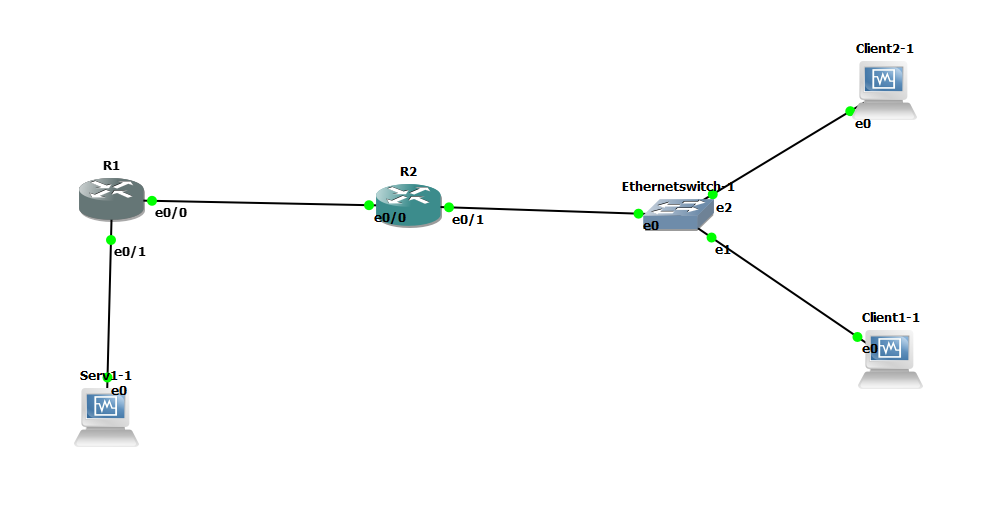

# B1A-tp-5-reseau


## 1. Préparation VMs

C'est beau


**Réseaux :**

* `net1` : `10.5.1.0/24`
* `net2` : `10.5.2.0/24`
* `net12` : `10.5.12.0/24`

**Machines :**

Machine | `net1` | `net2` | `net12`
--- | --- | --- | ---
`client1.tp5.b1` | X | `10.5.2.10` | X
`client2.tp5.b1` | X | `10.5.2.11` | X
`router1.tp5.b1` | `10.5.1.254` | X | `10.5.12.1`
`router2.tp5.b1` | X | `10.5.2.254` | `10.5.12.2`
`server1.tp5.b1` | `10.5.1.10` | X | X

# II. Lancement et configuration du lab

### Checklist IP VMs 

On parle de `client1.tp5.b1`, `client2.tp5.b1` et `server1.tp5.b1` :
* [X] Désactiver SELinux
  * déja fait dans le patron
* [X] Installation de certains paquets réseau
  * déja fait dans le patron
* [X] Désactivation de la carte NAT
  * déja fait dans le patron
* [X] Définition des IPs statiques
* [X] Définition du nom de domaine

### Checklist IP Routeurs 

On parle de `router1.tp5.b1` et `router2.tp5.b1` :
* [X] Définition des IPs statiques & définition du nom de domaine
  * Router 1:
  ```
  router1#show ip int br
  Interface                  IP-Address      OK? Method Status                Protocol
  Ethernet0/0                10.5.12.1       YES NVRAM  up                    up
  Ethernet0/1                10.5.1.254      YES NVRAM  up                    up
  Ethernet0/2                unassigned      YES NVRAM  administratively down down
  Ethernet0/3                unassigned      YES NVRAM  administratively down down
  ```
  * Router 2:
  ```
  router2#show ip int br
  Interface                  IP-Address      OK? Method Status                Protocol
  Ethernet0/0                10.5.12.2       YES NVRAM  up                    up
  Ethernet0/1                10.5.2.254      YES NVRAM  up                    up
  Ethernet0/2                unassigned      YES NVRAM  administratively down down
  Ethernet0/3                unassigned      YES NVRAM  administratively down down
  ```

### Checklist routes 

On parle de toutes les machines :
* [X] `router1.tp5.b1`  
  * directement connecté à `net1` et `net12`  
  * route à ajouter : 
  ```
  10.0.0.0/24 is subnetted, 3 subnets
  C      10.5.12.0 is directly connected, Ethernet0/0
  S      10.5.2.0 [1/0] via 10.5.12.254
                  [1/0] via 10.5.12.0
                  [1/0] via 10.5.12.2
  C      10.5.1.0 is directly connected, Ethernet0/1
  ```
* [X] `router2.tp5.b1`
  * directement connecté à `net2` et `net12`
  * route à ajouter : 
  ```
       10.0.0.0/24 is subnetted, 3 subnets
  C     10.5.12.0 is directly connected, Ethernet0/0
  C     10.5.2.0 is directly connected, Ethernet0/1
  S     10.5.1.0 [1/0] via 10.5.12.254
                 [1/0] via 10.5.12.0
                 [1/0] via 10.5.12.1
  ```
* [X] `server1.tp5.b1`
  * Vers client 1 
    ```
    [root@server1 etc]# ping client1
    PING client1 (10.5.2.10) 56(84) bytes of data.
    64 bytes from client1 (10.5.2.10): icmp_seq=1 ttl=62 time=64.2 ms
    64 bytes from client1 (10.5.2.10): icmp_seq=2 ttl=62 time=26.5 ms
    ```
  * Vers client 2
    ```
    [root@server1 etc]# ping client2
    PING client2 (10.5.2.11) 56(84) bytes of data.
    64 bytes from client2 (10.5.2.11): icmp_seq=1 ttl=62 time=43.3 ms
    64 bytes from client2 (10.5.2.11): icmp_seq=2 ttl=62 time=33.1 ms
    ```


* [X] `client1.tp5.b1`
  * Vers server 1
    ```
    [root@client1 etc]# ping server1
    PING server1 (10.5.1.10) 56(84) bytes of data.
    64 bytes from server1 (10.5.1.10): icmp_seq=1 ttl=62 time=36.7 ms
    64 bytes from server1 (10.5.1.10): icmp_seq=2 ttl=62 time=38.0 ms
    ```
* [X] `client2.tp5.b1`
  * Vers server 1
    ```
    [root@client2 etc]# ping server1
    PING server1 (10.5.1.10) 56(84) bytes of data.
    64 bytes from server1 (10.5.1.10): icmp_seq=1 ttl=62 time=34.7 ms
    64 bytes from server1 (10.5.1.10): icmp_seq=2 ttl=62 time=43.7 ms
    ```

    
# III. DHCP

## 1. Mise en place du serveur DHCP

**1. Configuration du serveur DHCP**
* Renommage (ouais c'est joli) du client 2 et activation du serveur dhcp
  ```
  [root@dhcp-net2 dhcp]# sudo systemctl status dhcpd
      Active: active (running) since Tue 2019-02-19 11:22:10 CET; 4min 41s ago
  ```

**2. Faire un test**
* nouvelle adresse ip de `client1` après dhcp
  ```
  2: enp0s3: <BROADCAST,MULTICAST,UP,LOWER_UP> mtu 1500 qdisc pfifo_fast state UP group default qlen 1000
    link/ether 08:00:27:7c:d5:8a brd ff:ff:ff:ff:ff:ff
    inet 10.5.2.50/24 brd 10.5.2.255 scope global noprefixroute dynamic enp0s3
  ```

## 2. Explorer un peu DHCP

**1. Discussion pour demande dhcp**
  ```
    No.   Time            Source          Destination         Protocol      Length    Info

    13	62.847114	0.0.0.0	        255.255.255.255	    DHCP	  342	    DHCP Discover - Transaction ID 0x94df7253
    16	63.850937	10.5.2.11	10.5.2.50	    DHCP	  342	    DHCP Offer    - Transaction ID 0x94df7253
    18	64.922755	0.0.0.0	        255.255.255.255	    DHCP	  342	    DHCP Request  - Transaction ID 0x94df7253
    19	65.026589	10.5.2.11	10.5.2.50	    DHCP	  342	    DHCP ACK      - Transaction ID 0x94df7253
  ```
  Là c'est mieux (j'avais sortie quelque chose de nul dans mes anciens push parceque j'avais mal compris le fonctionnement du dhcp)
  * Comme on peut le voir avec les inscriptions 0.0.0.0, le client 1 n'a pas d'ip et possède donc l'ip 0.0.0.0 par défaut, sur la première ligne il cherche à savoir si un serveur dhcp est présent dans ce réseau.
  * Sur la 2e ligne, on voit le dhcp (donc notre ancien client 2) lui répondre que oui et il lui propose une ip.
  * Sur la 3e ligne, le client 1 lui dit qu'il est ok pour l'adresse ip proposée et demande au passage si il peut toujours la prendre
  * Et enfin le serveur lui dit "its ok, vas y mon grand" et il lui fait signer un bail qui dit que au bout d'un moment bah il devra changer d'ip si il veut pas ressigner

A savoir que toute cette discussion est ponctuée de:

``` 
17	64.852935	PcsCompu_c0:37:99	Broadcast	ARP	60	Who has 10.5.2.50? Tell 10.5.2.11 
``` 
Pour être sur que personne ne possède l'adresse qui est demandé (le "who has") et si le serveur dhcp (le 10.5.2.11) n'a aucune réponse pour cette question, il considère que l'adresse est disponible et qu'il peut l'assigné à notre demandeur ici présent sous le nom de client1.

Si tu veux voir mon fichier pcap, tu peux aller [ici](demandedhcp.pcap).
   

### IV. Bonus